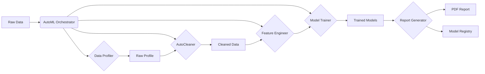

# OctoLearn Architecture Guide

Welcome to the architectural documentation for **OctoLearn**, an enterprise-grade AutoML library designed for transparency, robustness, and ease of use. This guide explains how the library is built, how the components interact, and the design decisions behind them.

---

## 1. System Overview

OctoLearn follows a **Pipeline Orchestration** pattern. The central `AutoML` class acts as the conductor, coordinating specialized workers (Profiler, Cleaner, Trainer, etc.) to transform raw data into a production-ready model and a comprehensive report.

### High-Level Data Flow

---

## 2. Core Components

### 2.1 The Orchestrator (`core.py`)
The `AutoML` class is the entry point. It manages state and executes the pipeline in phases:
1.  **Validation**: Checks input types and data quality.
2.  **Profiling**: Understands data types, missingness, and skew.
3.  **Cleaning**: Imputes missing values, encodes categories, scales numbers.
4.  **Engineering**: Detects outliers and creates interaction features.
5.  **Training**: Trains multiple models (RandomForest, XGBoost, etc.) with Optuna optimization.
6.  **Reporting**: Generates the PDF narrative.

### 2.2 Configuration Objects (`config.py` & `core.py`)
Instead of a giant list of arguments, OctoLearn uses **Dataclasses** to group settings logically. This makes the API clean and type-safe.

*   **`DataConfig`**: Sampling, test size, stratification.
*   **`ProfilingConfig`**: Outlier detection, interaction analysis.
*   **`PreprocessingConfig`**: Imputation strategies (mean/median), encoding (one-hot/label).
*   **`ModelingConfig`**: Which models to train, evaluation metrics.
*   **`OptimizationConfig`**: Optuna trials, timeout limits.
*   **`ReportingConfig`**: Report detail level, visualization limits.

---

## 3. The Pipeline Stages (Deep Dive)

### Phase 1: Profiling (`profiling/data_profiler.py`)
*   **Goal**: Understand the data *before* touching it.
*   **Mechanism**: analysis of pandas types, NaN counts, cardinality, and skewness.
*   **Output**: `DatasetProfile` object (contains metadata, not data).
*   **Why**: We need to know which columns are categorical to encode them correctly later.

### Phase 2: Cleaning (`preprocessing/auto_cleaner.py`)
*   **Goal**: Make data model-ready without leakage.
*   **Design**: Uses `sklearn.pipeline.Pipeline` with custom transformers.
*   **Key Feature**: `fit_transform` on Train, `transform` on Test. This ensures we don't learn stats (like mean for imputation) from the test set (Data Leakage prevention).
*   **Transformers**:
    *   `NumericImputer`: Fills NaNs with mean/median.
    *   `CategoricalImputer`: Fills NaNs with mode/constant.
    *   `RareCategoryEncoder`: Groups rare categories into "Other".
    *   `OneHotEncoder`: Converts categories to numbers.

### Phase 3: Feature Engineering (`experiments/`)
*   **Outlier Detection**: Uses IQR (Inter-Quartile Range) and Isolation Forest to flag anomalies.
*   **Interaction Analysis**: Looks for pairs of features that correlate strongly with the target when multiplied.

### Phase 4: Model Training (`models/model_trainer.py`)
*   **Goal**: Find the best model.
*   **Supported Models**: Scikit-Learn (LogisticRegression, SVM, RandomForest) + Gradient Boosting (XGBoost, LightGBM).
*   **Optimization**: Uses **Optuna** for Bayesian Hyperparameter Optimization. It tries smart combinations of parameters to maximize the metric (F1-score or RMSE).
*   **Benchmarking**: All models are evaluated on the *same* held-out test set.

### Phase 5: Reporting (`experiments/report_generator.py`)
*   **Technology**: `ReportLab` (Python library for PDF generation).
*   **Design**: uses a "Storytelling" approach. It doesn't just dump numbers; it constructs narratives ("The Data Story", "Health Dashboard").
*   **Visuals**: Uses `matplotlib` and `seaborn` to generate PNGs, which are then embedded into the PDF.

---

## 4. Directory Structure

| Directory | Key Files | Description |
|-----------|-----------|-------------|
| `octolearn/` | `core.py`, `config.py` | Main library logic. |
| `octolearn/profiling/` | `data_profiler.py` | Statistical analysis of data. |
| `octolearn/preprocessing/` | `auto_cleaner.py` | Data cleaning pipelines. |
| `octolearn/models/` | `model_trainer.py`, `registry.py` | Model training and versioning. |
| `octolearn/experiments/` | `report_generator.py`, `plot_generator.py` | PDF and Plot generation. |
| `octolearn/evaluation/` | `metrics.py` | Scoring functions (Accuracy, F1, etc). |

---

## 5. Design Decisions & Philosophy

### Why separate `fit` and `transform`?
To prevent **Data Leakage**. If you calculate the "mean" of a column using the *entire* dataset to fill missing values, your model "sees" the test data during training. OctoLearn strictly separates Train and Test.

### Why Optuna?
Grid Search is too slow. Optuna uses Bayesian optimization to "learn" which parameters work best, finding better models in less time.

### Why ReportLab?
HTML-to-PDF converters are often flaky. ReportLab allows essentially "drawing" the PDF programmatically, giving us pixel-perfect control over the layout unique to OctoLearn's brand.

---

## 6. How to Extend OctoLearn

1.  **Add a new Model**: Edit `octolearn/models/model_trainer.py`. Add the class to the `models` dictionary and define its hyperparameter search space in `_get_param_space`.
2.  **Add a new Check**: Edit `octolearn/profiling/data_profiler.py` to add new metrics to `DatasetProfile`.
3.  **Customize Report**: Edit `octolearn/experiments/report_generator.py` to add new sections.

---

*Verified Architecture v0.7.7*
