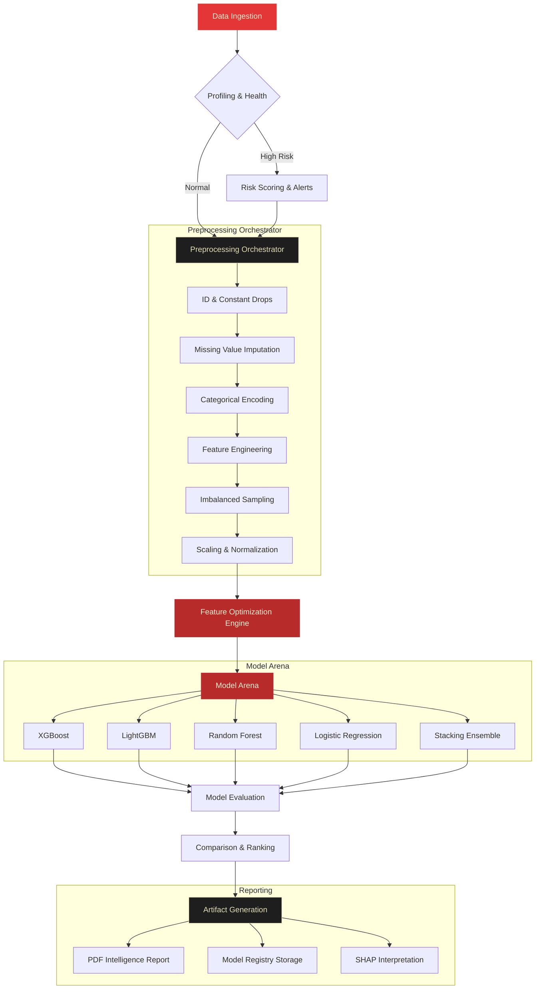
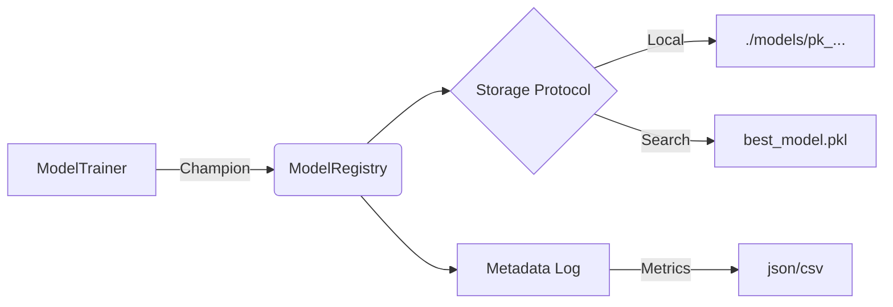

# Architecture Guide

Welcome to the complete architectural reference for **OctoLearn** — an enterprise-grade AutoML library built for transparency, robustness, and ease of use. This document explains *how* the library is built, *why* specific design choices were made, and *how to extend* it.

---

## 1. System Overview

OctoLearn follows a **Pipeline Orchestration** pattern. The central `AutoML` class acts as the conductor, coordinating specialized workers (Profiler, Cleaner, Trainer, ReportGenerator, etc.) to transform raw data into a production-ready model and a comprehensive PDF report.

### High-Level Data Flow



### Why a Pipeline Orchestrator?

The orchestrator pattern keeps each component **single-responsibility** and **independently testable**. You can swap out the cleaner, trainer, or report generator without touching the others. It also makes the execution order explicit and auditable.

---

## 2. Directory Structure

```text
OctoLearn/
├── octolearn/
│   ├── core.py                    # AutoML orchestrator + config dataclasses
│   ├── config.py                  # Global constants (Optuna, model registry)
│   ├── profiling/
│   │   └── data_profiler.py       # Statistical analysis → DatasetProfile
│   ├── preprocessing/
│   │   ├── auto_cleaner.py        # Imputation, encoding, scaling
│   │   └── sampler.py             # AutoSampler (SMOTE, Undersample)
│   ├── optimization/
│   │   └── feature_optimizer.py   # Optuna Feature Optimization Engine
│   ├── models/
│   │   ├── model_trainer.py       # Multi-model training + Optuna
│   │   └── registry.py            # Model versioning and persistence
│   ├── experiments/
│   │   ├── report_generator.py    # PDF report (ReportLab)
│   │   ├── plot_generator.py      # matplotlib/seaborn visualizations
│   │   └── recommendation_engine.py # Narrative Summary Engine
│   ├── evaluation/
│   │   └── metrics.py             # Scoring functions
│   ├── utils/
│   │   └── helpers.py             # Logging, utilities
│   ├── fonts/                     # ShantellSans TTF font files
│   └── images/                    # logo.png
├── tests/
│   └── test_complete_pipeline.py  # Integration test suite
├── ARCHITECTURE.md                # This file
├── README.md                      # High-level overview
├── guide.md                       # User manual & cookbook
└── testing.md                     # Benchmarking & QA protocols
```

---

!!! tip "NumPy Docstring Standard"
    Starting from version 0.10.0, OctoLearn has adopted the **NumPy Docstring Standard** across the entire codebase. Every public class and method is documented with:
    
    *   **Parameters**: Detailed type information and descriptions.
    *   **Returns**: Clear explanation of output types and semantics.
    *   **Attributes**: Internal state documentation for class instances.
    *   **Examples**: Doctype-runnable examples for quick onboarding.

---

## 4. Configuration System (`core.py`)

### Design: Dataclasses over kwargs

OctoLearn uses Python `@dataclass` objects instead of a flat list of keyword arguments. This provides:

- **Type safety**: IDE autocomplete and type checkers work correctly
- **Grouping**: Related settings are co-located (e.g., all Optuna settings in `OptimizationConfig`)
- **Defaults**: Each field has a sensible default, so `AutoML()` works out of the box
- **Discoverability**: Users can explore configs with `help(OptimizationConfig)`

### Config Objects

| Class | Key Fields | Rationale |
|-------|-----------|-----------|
| `DataConfig` | `sample_size=5000`, `sampling_strategy='auto'` | Sampling prevents OOM; handles class imbalance natively |
| `ProfilingConfig` | `detect_outliers=True`, `analyze_interactions=True` | Both are expensive; can be disabled for speed |
| `PreprocessingConfig` | `imputer_strategy`, `scaler='standard'`, `encoder_strategy` | Sensible defaults; user can override per-column |
| `FeatureOptimizationConfig`| `enable_feature_optimization=True`, `n_trials=20` | Jointly searches feature subsets, synthetic features, and models |
| `ModelingConfig` | `n_models=5`, `models_to_train=None`, `evaluation_metric=None` | Metric auto-detected from task type |
| `OptimizationConfig` | `optuna_trials_per_model=20`, `optuna_timeout_seconds=300` | Bayesian optimization speed/quality tradeoff |
| `ReportingConfig` | `report_detail='detailed'`, `visuals_limit=10` | "Dashboard" vs "Simple" plot modes |
| `ParallelConfig` | `n_jobs=1`, `backend='loky'` | Sequential Optuna for Windows safety |

### The `fit()` Override Pattern

`fit()` accepts optional keyword arguments that temporarily override config values for a single run. Internally, the original config values are snapshotted, overrides applied, pipeline executed, then originals restored in a `finally` block — ensuring non-destructive experimentation.

---

## 5. Intelligence Reporting (`experiments/`)

The reporting engine has evolved from static charts to **Contextual Intelligence**.

### Contextual Mathematical Narrative
Rather than simply outputting raw statistics, OctoLearn generates a **Mathematical Narrative**. It automatically interprets Pearson correlation coefficients, evaluates feature variance, and explains multi-collinearity in plain English. This guides stakeholders through a transparent "Data Journey," translating abstract metrics into concrete business impact.

### High-Dimensionality Fallbacks
When a dataset exceeds 10 features, the report automatically switches from a full correlation matrix to a **Top-N Correlation Bar Chart**. This prevents "visual noise" and focuses the analyst's attention on the most impactful predictive signals.

### Model Arena
The `ModelTrainer` reports results via the "Model Arena" — a competitive leaderboard that ranks models across multiple dimensions (Accuracy, F1, Latency, Calibration). The best model is promoted to the "Champion" slot, but full benchmarks are preserved for auditability.

---

## 6. Data Profiling (`profiling/data_profiler.py`)

### Output: `DatasetProfile`
A comprehensive metadata container storing:
- **Semantic Type Inference**: Distinguishes between 'numeric', 'categorical', 'id', 'date', and 'text' columns using layered heuristics.
- **Deep Statistical Boundaries**: Computes exhaustive descriptive statistics (Mean, Median, Std, Skewness, Kurtosis) for every numeric feature, flagging severe distribution skew (>2.0) out-of-the-box.
- **Data Quality Scoring**: A 0-100 score based on missingness, class imbalance, duplication, and potential leakage suspects.
- **Constraint Detection**: Identifies constant columns and high-cardinality/low-variance features early to save downstream training time.

---

## 7. Data Cleaning (`preprocessing/auto_cleaner.py`)

!!! info "The Leakage Prevention Rule"
    **`fit_transform` on Train only. `transform` on Test.**
    This prevents statistical leakage (e.g., test data means influencing train data imputations).

### Industrial-Strength Pipeline
1. **Adaptive Imputation**: Uses mode for categories and mean/median for numerics based on distribution skew.
2. **Rare Category Grouping**: Prevents feature explosion and overfitting by grouping low-frequency labels.
3. **Cardinality Management**: Smart selection between One-Hot and Ordinal encoding based on feature cardinality and task type.

---

## 8. Model Training (`models/model_trainer.py`)

### Bayesian Optimization (Optuna)
Optuna uses **Tree-structured Parzen Estimators (TPE)** to intelligently search the hyperparameter space. This approach builds a probabilistic model of "good" parameter regions, finding optimal settings significantly faster than Grid or Random Search.

### Stacking Ensembles
For production-grade performance, `ModelTrainer` can generate a **Stacking Ensemble**. This uses the top-performing base models (e.g., XGBoost, LightGBM) as "voters" and a meta-model (Logistic Regression) to compute the final prediction, often yielding a 1-3% boost in primary metrics.

---

## 9. Model Registry (`models/registry.py`)

### The Model Registry

OctoLearn doesn't just train models; it manages their lifecycle. The `ModelRegistry` ensures that every champion model is versioned and stored with its metadata.



### DatasetProfile: The Brain of OctoLearn
The `DatasetProfile` is a metadata-rich object that drives the entire pipeline. It contains:
- **Task Type Inference**: Automatic detection of classification vs. regression.
- **Leakage Analysis**: Statistical flags for features that mirror the target.
- **Quality Scoring**: A 0-100 score based on missingness, skew, and cardinality.

---
OctoLearn includes a local **Model Registry** for version control.
- **Versioned Artifacts**: Models are saved as `.pkl` files with version stamps.
- **Metadata Database**: A JSON backend tracks performance metrics, training timestamps, and hyperparameters for every version.
- **Safe Serialization**: Handles complex NumPy/Pandas return types safely during JSON serialization.

---

## 10. How to Build & Verify

### Running the Industry Benchmark
```bash
python test_complete_pipeline.py
```
This script exercises all 6 phases of the pipeline across diverse datasets to ensure 0-regression performance.

---

## 11. Key Architecture Principles

| Principle | Implementation |
|:---|:---|
| **Controllability** | Fine-grained configuration via nested dataclasses. |
| **Reproducibility** | Global random state management in `DataConfig`. |
| **Observability** | Real-time logging and detailed PDF intelligence reporting. |
| **Portability** | Pure Python dependency stack (no external DBs or binaries). |

---

*OctoLearn Architecture v0.10.0 — Updated 2026-02-21*
