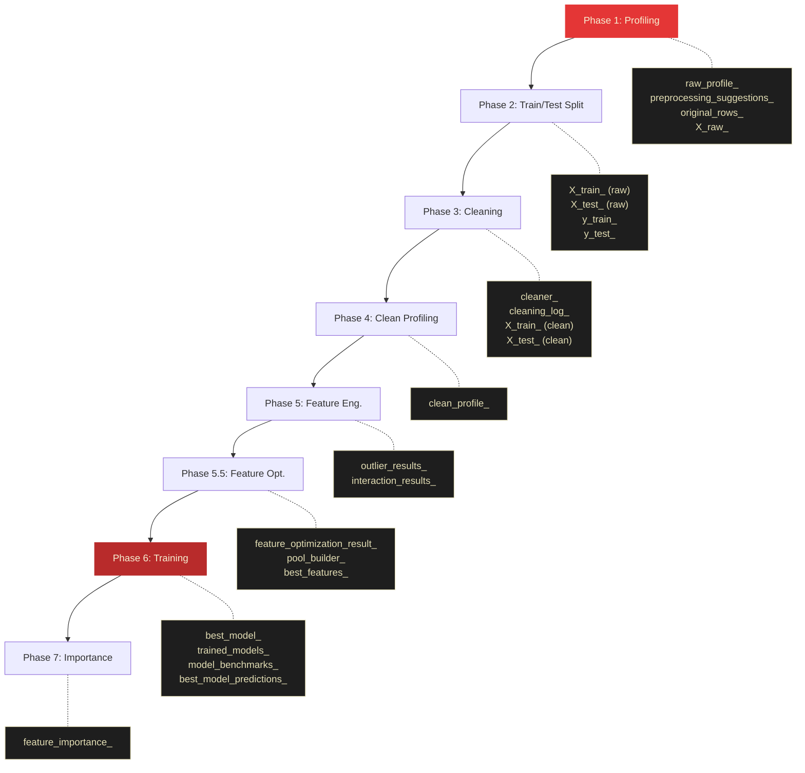
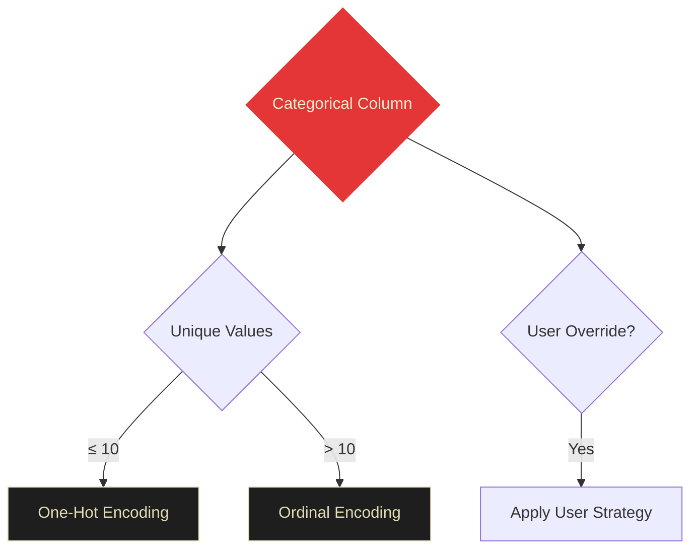
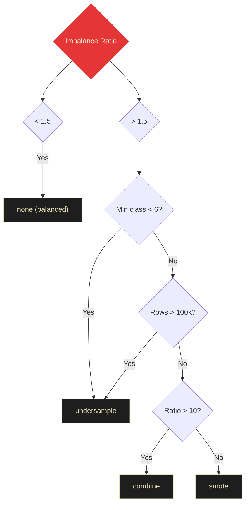

# Developer Guide

Welcome to the OctoLearn Developer Guide. This document provides module-by-module technical documentation for contributors and power users who want to understand **how** and **why** each component works.

---

## Module Architecture

```mermaid
graph TD
    subgraph "Entry Point"
        Core["core.py<br/>AutoML Orchestrator"]
        Config["config.py<br/>Global Constants"]
    end

    subgraph "Phase 1 — Analysis"
        Profiler["profiling/<br/>DataProfiler"]
        Risk["experiments/<br/>RiskScorer"]
        Suggest["experiments/<br/>PreprocessingSuggester"]
    end

    subgraph "Phase 3 — Preprocessing"
        Cleaner["preprocessing/<br/>AutoCleaner"]
        Sampler["preprocessing/<br/>AutoSampler"]
        PipeB["preprocessing/<br/>PipelineBuilder"]
    end

    subgraph "Phase 5 — Features"
        FeatGen["feature/<br/>FeatureGenerator"]
        Interact["feature/<br/>InteractionAnalyzer"]
        Outlier["experiments/<br/>OutlierDetector"]
    end

    subgraph "Phase 5.5 — Optimization"
        FeatOpt["optimization/<br/>FeatureOptimizer"]
        PoolB["optimization/<br/>_FeaturePoolBuilder"]
    end

    subgraph "Phase 6 — Training"
        Trainer["models/<br/>ModelTrainer"]
        Registry["models/<br/>ModelRegistry"]
        Eval["evaluation/<br/>ModelEvaluator"]
    end

    subgraph "Phase 7 — Reporting"
        Report["experiments/<br/>ReportGenerator"]
        Plots["experiments/<br/>PlotGenerator"]
        Importance["experiments/<br/>BaselineImportance"]
        Recommend["experiments/<br/>RecommendationEngine"]
    end

    subgraph "Cross-Cutting"
        Helpers["utils/<br/>helpers.py"]
    end

    Core --> Config
    Core --> Profiler
    Core --> Cleaner
    Core --> Sampler
    Core --> FeatGen
    Core --> FeatOpt
    Core --> Trainer
    Core --> Report

    Profiler --> Risk
    Profiler --> Suggest
    FeatGen --> Interact
    FeatOpt --> PoolB
    Trainer --> Eval
    Trainer --> Registry
    Report --> Plots
    Report --> Importance
    Report --> Recommend
    Report --> Outlier

    Helpers -.-> Core
    Helpers -.-> Profiler
    Helpers -.-> Cleaner
    Helpers -.-> Trainer

    style Core fill:#E43636,color:#F6EFD2,stroke:#E43636
    style Config fill:#1e1e1e,color:#E2DDB4,stroke:#E2DDB4
    style FeatOpt fill:#b82b2b,color:#F6EFD2,stroke:#b82b2b
    style Trainer fill:#b82b2b,color:#F6EFD2,stroke:#b82b2b
    style Report fill:#1e1e1e,color:#E2DDB4,stroke:#E2DDB4
```



---

## Configuration System

All behavior is controlled through 8 `@dataclass` config objects passed to the `AutoML` constructor. Each config isolates a specific concern:

```mermaid
classDiagram
    class AutoML {
        +data_config: DataConfig
        +profiling_config: ProfilingConfig
        +preprocessing_config: PreprocessingConfig
        +modeling_config: ModelingConfig
        +optimization_config: OptimizationConfig
        +feature_optimization_config: FeatureOptimizationConfig
        +reporting_config: ReportingConfig
        +parallel_config: ParallelConfig
        +fit(X, y, **overrides)
        +predict(X_new)
        +generate_report()
        +get_pipeline()
    }

    class DataConfig {
        +use_full_data: bool = False
        +sample_size: int = 500
        +test_size: float = 0.2
        +random_state: int = 42
        +stratify_target: bool = True
        +sampling_strategy: str = 'auto'
    }

    class ProfilingConfig {
        +detect_outliers: bool = True
        +analyze_interactions: bool = False
        +generate_risk_score: bool = True
        +calculate_feature_importance: bool = True
        +generate_recommendations: bool = True
    }

    class PreprocessingConfig {
        +auto_clean: bool = True
        +imputer_strategy: dict = None
        +scaler: str = 'standard'
        +id_columns: list = None
    }

    class ModelingConfig {
        +train_models: bool = True
        +n_models: int = 5
        +models_to_train: list = None
        +evaluation_metric: str = None
        +use_stacking: bool = True
    }

    class OptimizationConfig {
        +use_optuna: bool = True
        +optuna_trials_per_model: int = 20
        +optuna_timeout_seconds: int = 300
        +baseline_score: float = None
    }

    class FeatureOptimizationConfig {
        +enable_feature_optimization: bool = True
        +n_trials: int = 40
        +max_synthetic_features: int = 30
        +generate_interactions: bool = True
        +generate_ratios: bool = True
    }

    class ReportingConfig {
        +generate_report: bool = True
        +report_detail: str = 'detailed'
        +include_shap: bool = True
        +color_scheme: str = 'light'
    }

    class ParallelConfig {
        +n_jobs: int = -1
        +backend: str = 'threading'
        +enable_gpu: bool = False
    }

    AutoML --> DataConfig
    AutoML --> ProfilingConfig
    AutoML --> PreprocessingConfig
    AutoML --> ModelingConfig
    AutoML --> OptimizationConfig
    AutoML --> FeatureOptimizationConfig
    AutoML --> ReportingConfig
    AutoML --> ParallelConfig
```



**Why dataclasses over kwargs?**
Grouping related settings provides IDE autocomplete, type safety, and discoverability via `help()`. The `fit()` override pattern lets users temporarily change settings for a single run without mutating the stored config.

---

## Pipeline Variable Flow

This diagram shows which `AutoML` attributes are populated at each phase:



---

## Module Deep-Dives

### 1. `core.py` — The Orchestrator

The `AutoML` class is the central conductor. It does **no computation itself** — instead orchestrating specialized workers in sequence.

**Key patterns:**

- **Snapshot-Restore for `fit()` overrides**: Before applying per-call overrides, `fit()` snapshots all config values. After execution (in a `finally` block), the original values are restored. This enables non-destructive experimentation.
- **Defensive phase execution**: Each phase is wrapped in try/except. If a non-critical phase fails (e.g., outlier detection), the pipeline continues with a warning.
- **The `predict()` replay**: `predict()` replays the exact preprocessing used during `fit()`: `cleaner_.transform()` → optional `pool_builder_.transform()` → feature selection → `best_model_.predict()`.

```python
# The predict() flow
def predict(self, X_new):
    X = self.cleaner_.transform(X_new)          # Same cleaning
    if self.pool_builder_ is not None:
        X = self.pool_builder_.transform(X)     # Same synthetic features
        X = X[self.best_features_]              # Same feature subset
    return self.best_model_.predict(X)
```

---

### 2. `profiling/data_profiler.py` — Intelligence Gathering

The profiler's **type inference** uses a multi-layer heuristic because raw dtype is unreliable:

1. Check if the column name contains ID patterns (`_id`, `uuid`, `key`)
2. Check unique ratio: if >90% unique values in a non-float column → `id`
3. Try `pd.to_datetime()` on a sample → `date`
4. Check dtype → `numeric` or `categorical`
5. Check average string length > 50 → `text`

**Leakage detection** flags features with Pearson |r| > 0.95 with the target. This catches common mistakes like including a "churn_date" column when predicting "churn".

---

### 3. `preprocessing/auto_cleaner.py` — Industrial Cleaning

The `fit_transform()` / `transform()` split is **critical** for preventing data leakage:

```python
# CORRECT (what OctoLearn does):
cleaner.fit(X_train)           # Learn stats from train only
X_train_clean = cleaner.transform(X_train)
X_test_clean = cleaner.transform(X_test)   # Apply SAME stats

# WRONG (would cause leakage):
cleaner.fit(X_all)             # Test data influences statistics!
```

**Rare category handling**: Categories appearing in <1% of training rows are mapped to `_OTHER`. During `transform()`, any unseen category is also mapped to `_OTHER`, preventing errors on new data.

**Encoding decision tree:**



---

### 4. `preprocessing/sampler.py` — Imbalance Handling

**Why sampling is applied AFTER cleaning but BEFORE feature optimization:**

1. Cleaning must happen first (SMOTE needs numeric data)
2. Sampling creates synthetic rows, so it must happen before any feature analysis
3. Sampling is **never** applied to test data — only training data

The `auto` strategy uses a decision tree:



---

### 5. `optimization/feature_optimizer.py` — The Brain

The Feature Optimization Engine is OctoLearn's most advanced component. It replaces the traditional "fixed features → tune model" workflow with a **unified search** over the full `(features × model × hyperparameters)` space.

**The Feature Pool Builder** generates candidates:

| Type | Example | Max Count |
|:---|:---|:---|
| Original features | `age`, `salary` | All |
| Interactions | `int_age_x_salary` | `top_k_interactions` (15) |
| Ratios | `rat_age_div_salary` | `top_k_ratios` (10) |
| Polynomials | `poly_age_sq` | Budget remaining |
| Log transforms | `log_salary` | Skewed features |

**Total budget**: Controlled by `max_synthetic_features` (default: 30).

**The Recipe Pattern**: The builder stores a `recipe_` dict recording exactly which operations were performed. During `predict()`, this recipe is replayed on new data via `pool_builder_.transform()`, ensuring train-test consistency.

---

### 6. `models/model_trainer.py` — The Arena

**Joint Bayesian Optimization:**

Instead of running Optuna separately for each model, OctoLearn uses a **joint study** where `model_type` is a categorical hyperparameter alongside the model-specific parameters. This lets TPE discover cross-model patterns (e.g., "XGBoost with depth=3 beats LightGBM with depth=6").

**Thread safety during Optuna:**

Optuna can run trials in parallel, but nested parallelism (Optuna workers × model n_jobs) causes CPU oversubscription. The trainer:
1. Forces `n_jobs=1` on all models during Optuna trials
2. Sets `OMP_NUM_THREADS=1` and similar env vars
3. Only uses Optuna's own `n_jobs` for parallelism

---

### 7. `evaluation/metrics.py` — Scoring

**ROC-AUC adaptation:**

```python
if n_classes == 2:
    # Binary: use probability of class 1
    auc = roc_auc_score(y_test, model.predict_proba(X_test)[:, 1])
else:
    # Multiclass: One-vs-Rest with weighted average
    auc = roc_auc_score(y_test, model.predict_proba(X_test),
                        multi_class='ovr', average='weighted')
```

---

### 8. `experiments/` — Intelligence Reporting

The reporting pipeline follows a **components → assembly** pattern:

1. `_generate_report_components()` in `core.py` collects all data (plots, scores, recommendations)
2. `ReportGenerator` assembles everything into a structured PDF

**Adaptive visualizations:**

- **≤10 features**: Full N×N correlation heatmap
- **>10 features**: Top-N correlation bar chart (prevents visual noise)
- **Feature importance**: Horizontal bar chart sorted by importance

---

### 9. `utils/helpers.py` — Cross-Cutting

**The `@log_execution` decorator:**

Applied to every major pipeline method. It logs start time and duration, creating an audit trail:

```
2026-03-25 14:51:30 - Starting fit...
2026-03-25 14:51:30 - fit completed in 0.07s
```

**The `@handle_exceptions` decorator:**

Catches exceptions and logs full tracebacks. When `raise_error=False`, it returns `None` instead of crashing — used for non-critical operations like SHAP plots.

---

## Global Configuration Constants

The `config.py` file contains all hardcoded thresholds and search spaces. Key sections:

| Constant Group | Purpose | Key Values |
|:---|:---|:---|
| `PROFILING_CONFIG` | Type detection thresholds | `ID_UNIQUE_RATIO=0.9`, `CARDINALITY_THRESHOLD=50` |
| `FEATURE_GENERATION_CONFIG` | Feature engineering toggles | `skew_threshold=1.0`, `date_parts=['year','month','day']` |
| `INTERACTION_CONFIG` | Interaction analysis | `types=['polynomial','interaction','ratio']`, `min_corr=0.1` |
| `MODEL_TRAINING_CONFIG` | Model lists and defaults | Classification: 6 algorithms, Regression: 6 algorithms |
| `OPTUNA_CONFIG` | HPO search spaces | Per-model parameter ranges (e.g., `n_estimators: [50, 500]`) |
| `FEATURE_OPTIMIZATION_CONFIG` | Feature optimizer settings | `max_synthetic=30`, `top_k_interactions=15` |
| `EVALUATION_CONFIG` | Metric lists | Classification: 6 metrics, Regression: 5 metrics |
| `LOGGING_CONFIG` | Logger settings | Level, format, optional file output |

---

## Extending OctoLearn

### Adding a New Model

1. Add the model key to `MODEL_TRAINING_CONFIG['classification_models']` or `['regression_models']` in `config.py`
2. Add the hyperparameter search space to `OPTUNA_CONFIG['hyperparameters']`
3. Add the build logic to `ModelTrainer._build_model()` in `model_trainer.py`
4. Add the same build logic to `FeatureOptimizer._build_model()` in `feature_optimizer.py`

### Adding a New Metric

1. Add the metric key to `EVALUATION_CONFIG` in `config.py`
2. Add the computation logic to `ModelEvaluator._evaluate_classification()` or `._evaluate_regression()` in `metrics.py`

### Adding a New Synthetic Feature Type

1. Add a generation method to `_FeaturePoolBuilder` in `feature_optimizer.py`
2. Add a corresponding `transform()` entry to replay the generation on new data
3. Add a config toggle to `FEATURE_OPTIMIZATION_CONFIG` in `config.py`

---

*OctoLearn Developer Guide — Updated 2026-03-25*
