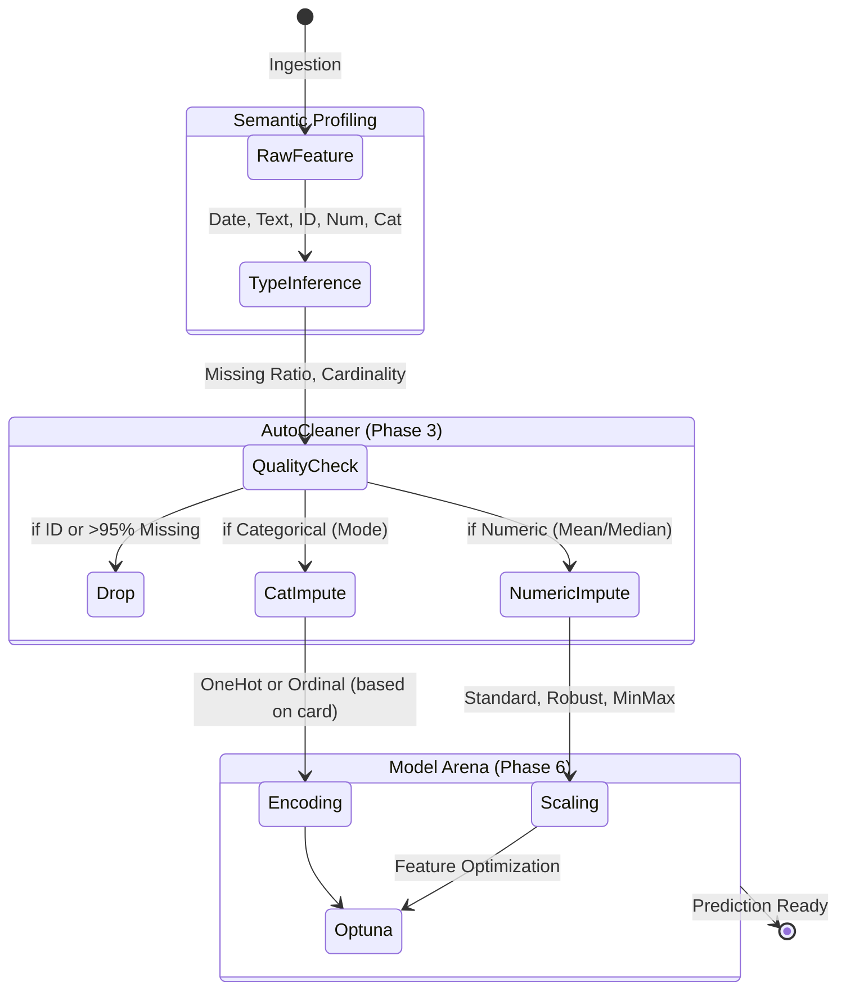

# OctoLearn User Guide

Welcome to the comprehensive guide for OctoLearn. This document provides in-depth information on how to configure and extend the AutoML pipeline.


---

## Core Concepts

OctoLearn is built on the principle of **Transparent AutoML**. Unlike other libraries that hide the "magic" inside a black box, OctoLearn exposes the results of every stage—from raw data profiling to final model staging.

### The fit-then-report Pattern
Success with OctoLearn follows a simple pattern:

1. **`fit()`**: Orchestrates the technical pipeline (cleaning, tuning, training).
2. **`generate_report()`**: Decodes the technical results into human-readable business intelligence.

!!! tip "Remember the Report"
    The real power of OctoLearn isn't just the model—it's the PDF report. Always generate a report before deploying!

---

## Configuration Reference

You can pass specific configuration objects to the `AutoML` constructor to control behavior.

### DataConfig
Controls how data is sampled and split.
- `use_full_data`: If True, bypasses sampling.
- `test_size`: Fraction of data held out for validation (default 0.2).
- `random_state`: Integer seed for reproducibility.
- `sampling_strategy`: Handles imbalanced data natively (`'auto'`, `'smote'`, `'undersample'`, etc.).

### PreprocessingConfig
Controls the automated data cleaning engine.
- `imputer_strategy`: `{'numeric': 'median', 'categorical': 'mode'}`.
- `scaler`: `'standard'`, `'robust'`, or `'minmax'`.

---

## Advanced Features

### Class Imbalance Handling
OctoLearn automatically detects class imbalance during profiling and utilizes stratified splitting to ensure stable evaluation metrics.

### Target Leakage Detection
The `DataProfiler` looks for features that are essentially identical to or highly correlated with the target, flagging them as potential "leakage suspects" in the risk report.

---

## Understanding the Data Transformation

To truly trust an AutoML pipeline, you must understand exactly how it mutates your dataset. Here is the lifecycle of a single feature within OctoLearn:



### Accessing Intermediate States
You can pause the pipeline or inspect it at any point. Let's view the `AutoCleaner` logs to see what was dropped:

```python
automl = AutoML(preprocessing_config=PreprocessingConfig(auto_clean=True))
automl.fit(X, y)

# What did the cleaner actually do?
print(automl.cleaning_log_)
# Expected Output:
# {
#   "dropped_columns": ["customer_id", "timestamp_utc"],
#   "imputed_numeric": {"age": "median (34.0)", "salary": "mean (56000.0)"},
#   "imputed_categorical": {"state": "mode (CA)"}
# }
```

---

## Advanced Tutorial: Deep Configuration
OctoLearn shines when you take fine-grained control over its internal components. Let's look at how to tune the Optuna integration for maximum performance using the `OptimizationConfig` class.

### Tuning the Bayesian Search
By default, OctoLearn employs Tree-structured Parzen Estimator (TPE) via Optuna. You can override the trial count and timeout settings to force a deep search:

```python
from octolearn import AutoML, OptimizationConfig

deep_tuner = OptimizationConfig(
    use_optuna=True,
    optuna_trials_per_model=100,      # Run many more trials
    optuna_timeout_seconds=3600,      # Give each model an hour
    optuna_parallel_jobs=-1,          # Utilize all CPU cores safely
    use_registry=True                 # Remember all checkpoints
)

# Pass the custom tuning behavior to the orchestrator
automl = AutoML(optimization_config=deep_tuner)
automl.fit(X, y)
```

## Methodology

### Stacking Ensembles
When multiple models are selected for training, OctoLearn generates a Stacking Regressor or Classifier by using the top-performing base models and a meta-model to blend their predictions.

---

## Troubleshooting

### PDF Generation Fails
!!! failure "Missing Fonts or Dependencies"
    Ensure you have `reportlab` installed. If your environment lacks specific fonts, OctoLearn will automatically fallback to standard Helvetica, but if `reportlab` itself is missing, the CLI will throw an `ImportError`.

### Optuna is Too Slow
!!! warning "Bayesian Search Latencies"
    Bayesian Optimization takes time to build its probabilistic model of the parameter space. If it's running too slow for your dev cycle, reduce `optuna_trials_per_model` or temporarily disable it by passing `use_optuna=False` to your `fit()` call.

---

### The `DataProfiler` Deep Dive
OctoLearn's profiler is the first step of intelligence. Here is how you can access the raw profiling data natively:

```python
automl = AutoML(train_models=False) # Do a profiling-only run
automl.fit(X, y)

profile = automl.raw_profile_

print(f"Dataset Size: {profile.shape}")
print(f"Identified ID Columns: {profile.id_like_columns}")
print(f"Constant/Useless Columns: {profile.constant_columns}")

# Data Quality Diagnostics
print("Missing Data Summary:")
# Expected: {'age': 4.2%, 'salary': 1.1%, 'state': 0.0%}

print(f"Risk Score: {automl.get_risk_score()['score']}/100")
# Expected: "84/100 (Moderate Risk)"
```

### The `ModelRegistry` Outputs
Every time OctoLearn successfully trains a champion model, it is saved in the `models/` directory natively.

```python
from octolearn.models.registry import ModelRegistry

registry = ModelRegistry()
# List all saved champions
print(registry.list_models())
# Expected: ['xgboost_champion_v1', 'stacking_ensemble_v2', 'lightgbm_champion_v1']

# Load the best model directly without re-training
best_model = registry.get_best_model(metric="f1_score")
predictions = best_model.predict(X_new)
```

---

## Expected CLI Output Example
When running OctoLearn, you will see a detailed execution log similar to this:

```text
2024-02-24 17:10:00 - octolearn.core - INFO - AutoML initialized (v0.9.0)
2024-02-24 17:10:00 - octolearn.core - INFO - [PHASE 1] Initializing Profiler...
2024-02-24 17:10:01 - octolearn.profiling - INFO - Profiling complete. Quality Score: 84.5
2024-02-24 17:10:01 - octolearn.preprocessing - INFO - Removed ID columns: ['user_id']
2024-02-24 17:10:01 - octolearn.preprocessing - INFO - Imputed 142 missing values in 3 columns.
2024-02-24 17:10:02 - octolearn.core - INFO - [PHASE 5.5] Optuna Feature Optimization Engine...
2024-02-24 17:10:05 - octolearn.feature_optimizer - INFO - Optimized features: 12 (Baseline: 0.81 -> New: 0.89)
2024-02-24 17:10:06 - octolearn.models - INFO - Starting Model Training (using optimized model: XGBoost)
2024-02-24 17:10:08 - octolearn.core - INFO - Pipeline complete! [OK]
```
