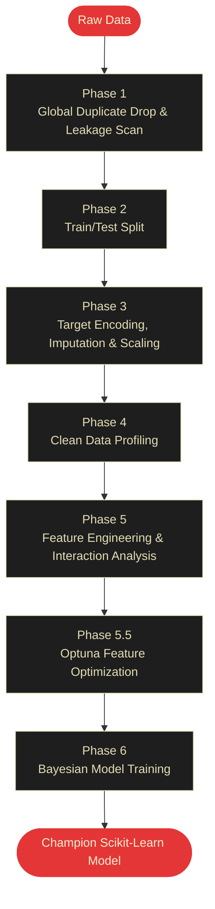

# OctoLearn: The Official User Guide

Welcome to OctoLearn! If you are here, you want to build high-performance machine learning models—and generate deep analytical insights—without spending three days writing boilerplate `pandas` and `scikit-learn` code.

This guide will teach you exactly how to use the library, what happens under the hood, and **exactly what outputs to expect** from every major function.

---

## 1. Installation

Install OctoLearn via pip:

```bash
pip install octolearn
```

*Requirements: Python ≥ 3.9, scikit-learn, pandas, numpy, optuna, reportlab, shap, lightgbm, xgboost*

---

## 2. The "Five Minute" Quickstart

Here is the absolute fastest way to train a model on your own data.

> [!IMPORTANT]
> **Preventing Data Leakage**: Always explicitly drop your target column from your feature matrix (`X`). If you accidentally leave the answers inside `X`, your model will falsely score 100% accuracy! (OctoLearn has auto-guards to try and catch this, but explicit separation is the gold standard).

```python
import pandas as pd
from octolearn import AutoML

# 1. Load your messy, raw data
df = pd.read_csv("customer_churn.csv")

# 2. Separate Features (X) and Target (y)
X = df.drop(columns=["Churn"])
y = df["Churn"]

# 3. Initialize the Orchestrator
automl = AutoML()

# 4. Optional: Check how long it will take
print(automl.estimate_time(X)) 
# Output: "Estimated pipeline completion time: ~2 min 45 sec"

# 5. Run the End-to-End Pipeline
automl.fit(X, y)

# 6. Generate Predictions on new data
predictions = automl.predict(X_new)
print(predictions)
# Output: ['Yes', 'No', 'No', 'Yes', 'No']
```

---

## 3. Extracting the "Gold": What Do The APIs Actually Return?

Once `fit()` finishes, OctoLearn holds a massive amount of intelligence about your dataset. Here is exactly how to extract that data and **what the outputs look like**.

### A. Data Quality Risk Score
Assess how "dirty" your dataset was before cleaning.

```python
risk = automl.get_risk_score()
print(risk)
```
**Expected Output:**
```json
{
  "score": 85.0,
  "category": "Good",
  "factors": {
    "missing_data_penalty": -5.0,
    "leakage_penalty": 0.0,
    "duplicate_row_penalty": -10.0
  }
}
```

### B. Automated Preprocessing Suggestions
See exactly what OctoLearn's `AutoCleaner` decided to do with your messy data.

```python
suggestions = automl.get_preprocessing_suggestions()
```
**Expected Output:**
```json
{
  "missing_value_strategy": [
    "Imputed 'Age' using median strategy.",
    "Filled 12% missing values in 'Income' with mean."
  ],
  "categorical_encoding": [
    "One-Hot Encoded low-cardinality feature 'Gender'.",
    "Target-Encoded high-cardinality feature 'ZipCode'."
  ],
  "risk_mitigation": [
    "Dropped identical duplicate rows before Train/Test split."
  ]
}
```

### C. Feature Importance
Find out which features actually drove the model's decisions.

```python
importance = automl.get_feature_importance()
```
**Expected Output:**
```json
{
  "MonthlyCharges": 0.42,
  "Tenure": 0.31,
  "ContractType_TwoYear": 0.15,
  "Age": 0.08,
  "Gender_Female": 0.04
}
```

### D. Model Leaderboard
OctoLearn trains multiple algorithms simultaneously to find the champion. You can view the final arena scoreboard:

```python
benchmarks = automl.get_model_benchmarks()
```
**Expected Output:**
```python
[
  {'model': 'lightgbm', 'score': 0.942, 'metrics': {'f1': 0.942, 'accuracy': 0.951}},
  {'model': 'xgboost', 'score': 0.938, 'metrics': {'f1': 0.938, 'accuracy': 0.949}},
  {'model': 'random_forest', 'score': 0.910, 'metrics': {'f1': 0.910, 'accuracy': 0.920}}
]
```

---

## 4. The PDF Intelligence Report

You don't just have to rely on code outputs. OctoLearn's greatest feature is its ability to automatically generate a beautifully formatted, multi-page PDF report designed for business stakeholders.

```python
pdf_path = automl.generate_report(filename="Churn_Analysis_Report.pdf")
```
This report automatically includes:
1. **Data Health & Risk Factors**: Visualizing NaNs, infinite values, and duplicates.
2. **The Data Journey**: "Before and After" distribution curves proving that the cleaner successfully normalized the data.
3. **Correlation Heatmaps**: Detecting leakage and multicollinearity.
4. **SHAP Analysis**: Global explainability proving *why* the champion model makes its decisions.

---

## 5. Production Deployment (Zero Lock-In)

Most AutoML libraries try to lock you into their ecosystem. OctoLearn explicitly designs an exit ramp. 

Once your model has finished training, you can export the entire optimal pipeline into a standalone, heavily commented Python script. 

```python
# Export the pipeline to a local python file
automl.export_pipeline_code("best_pipeline.py")
```

**Why this matters:** 
The generated `best_pipeline.py` relies entirely on native `scikit-learn` and `pandas`. You can hand this file to your dev-ops team, and they can deploy it to AWS, a Docker container, or a FastAPI server **without ever needing to pip install OctoLearn in production***. 

---

## 6. Advanced Customization (The Dataclasses)

If you don't want to use the default settings, OctoLearn allows you to hyper-tune the pipeline using 8 `@dataclass` configuration objects.

You simply pass these configs directly into the `AutoML` constructor!

```python
from octolearn import AutoML, DataConfig, ModelingConfig, OptimizationConfig

automl = AutoML(
    # 1. Custom Data Split
    data_config=DataConfig(
        test_size=0.15,            # Only hold out 15% for testing
        stratify_target=True       # Balance classes during the split
    ),
    
    # 2. Custom Model Training
    modeling_config=ModelingConfig(
        models_to_train=['xgboost', 'lightgbm'], # Only train these two
        evaluation_metric='roc_auc'              # Optimize for AUC instead of F1
    ),
    
    # 3. Custom Optuna Sweeps
    optimization_config=OptimizationConfig(
        optuna_trials_per_model=50,      # Run 50 Bayesian search trials per model
        optuna_timeout_seconds=600       # Allow up to 10 minutes per model
    )
)

# Run the highly customized pipeline!
automl.fit(X, y)
```

---

## 7. Understanding the Pipeline Architecture

Ever wonder what `automl.fit(X, y)` is actually doing behind the scenes? It executes a strict 7-phase flow:



This strict architectural flow is what guarantees mathematical safety. For example, by forcing **Phase 2 (Train/Test Split)** to happen *before* **Phase 3 (Imputation)**, OctoLearn mathematically guarantees that statistical data from your test set cannot "leak" into your training set!
