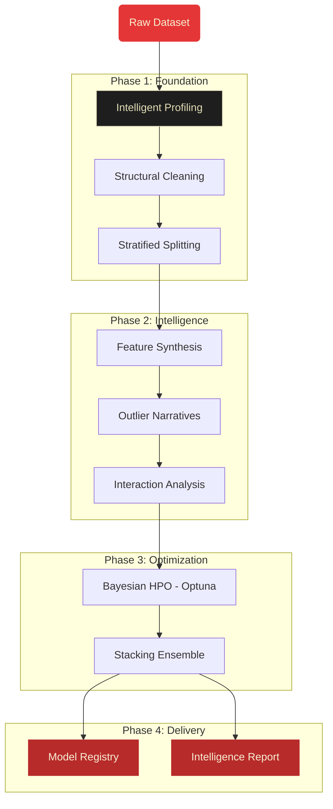

<p align="center">
  
</p>

<h1 align="center">OctoLearn</h1>

<p align="center">
  <strong>The Enterprise-Grade AutoML Orchestrator for Python.</strong><br>
  Deliver production-ready machine learning from messy data in minutes, not weeks.
</p>

---

OctoLearn is designed for data scientists and engineers who need more than just a "black box" model. It provides **transparent, controllable, and professional** machine learning workflows that automate the tedious parts of data science while giving you full oversight through high-fidelity intelligence reports.

## The OctoLearn Advantage

Most AutoML libraries focus solely on leaderboard scores. OctoLearn focuses on the **entire lifecycle**:

1.  **Observability**: Detailed profiling and risk scoring tell you *why* your data might fail.
2.  **Transparency**: The "Data Journey" in our reports shows exactly how every feature was transformed.
3.  **Communication**: Stakeholder-ready PDF reports that look like McKinsey-level analysis.
4.  **Control**: Override any part of the pipeline via simple config objects or per-run parameters.

---

## Enterprise DNA: Our Philosophy

OctoLearn was built on the belief that **Automation should not mean Blindness**. In high-stakes environments (Finance, Healthcare, Engineering), a high F1-score is useless if you don't understand the risks in your training set.

### Observability First
Every run begins with a deep statistical audit. We don't just find missing values; we analyze their pattern to detect **Systemic Missingness** and **Data Leakage**.

### Total Control
While we provide "Surprise Me" defaults, the library is designed for power users. Every phase of the pipeline—from the imputer strategy to the Bayesian search space—is fully customizable.

### Production-Ready Insights
We believe the output of an AutoML run should be as much a **Decision Support Tool** as it is a model file. Our PDF reports translate complex SHAP values and residuals into actionable business narratives.

---

## Features at a Glance

| Pillar | Capability |
|:---|:---|
| **Intelligence** | Auto-detects feature types, class imbalance, and **Data Leakage** suspects. |
| **Resilience** | Industrial-strength cleaners handle outliers, missing values, and high-cardinality features. |
| **Imbalanced Learning** | Native support for SMOTE, ADASYN, and Undersampling to handle class imbalance. |
| **Feature Synthesis** | Automatically generates interaction terms, ratios, polynomials, and log-transforms via the **Feature Optimization Engine**. |
| **Performance** | Joint Optuna search over feature subsets, synthetic features, models, and hyperparameters. |
| **Outlier Narratives** | Multi-method outlier detection (IQR, Z-score, Isolation Forest) with narrative context in the PDF report. |
| **Interaction Analysis** | Statistical pairwise feature interaction analysis with correlation narratives. |
| **Risk Scoring** | Data quality risk score (0–100) flagging leakage, imbalance, missingness, and skew. |
| **Clarity** | Magazine-style PDF reports with SHAP explainability and actionable business narratives. |
| **Deployment** | Export the full Preprocessing + Best Model pipeline as a single sklearn object. |

---

## Installation

!!! info "Virtual Environment Recommended"
    Before installing OctoLearn, we recommend creating and activating a Python virtual environment to avoid dependency conflicts.

```bash
pip install git+https://github.com/GhulamMuhammadNabeel/OctoLearn.git
```

---

## Quick Start: Production Pipeline in 30 Seconds

=== "Surprise Me API"

    Want to see OctoLearn in action instantly without providing your own data? Use the `surprise_me` API to automatically download a benchmark dataset, run the full pipeline, and generate a beautiful intelligence report.

    ```python
    from octolearn import AutoML

    # Run the complete pipeline on a sample classification dataset
    pdf_path, best_model = AutoML.surprise_me(task='classification')
    print(f"Report saved to: {pdf_path}")
    ```

=== "Standard Usage"

    Bring your own dataset and let OctoLearn orchestrate the profiling, cleaning, tuning, and evaluation out of the box.

    ```python
    from octolearn import AutoML
    import pandas as pd

    # 1. Ingest Data
    df = pd.read_csv("telecom_churn.csv")
    X, y = df.drop("churn", axis=1), df["churn"]

    # 2. Orchestrate (Profile, Clean, Tune, Evaluate)
    automl = AutoML()
    automl.fit(X, y)

    # 3. Deliver Insight
    pdf_report = automl.generate_report()
    print(f"Analysis complete: {pdf_report}")
    ```

=== "Profile Only"

    Need deep visibility into your dataset without the computational cost of training models? OctoLearn's profiler can execute independently.

    ```python
    automl = AutoML(train_models=False)
    automl.fit(X, y)

    # Access insights
    profile = automl.raw_profile_
    print(f"Rows: {profile.n_rows}, Columns: {profile.n_columns}")
    print(f"Task type: {profile.task_type}")
    print(f"Missing values: {profile.missing_ratio}")

    # Risk assessment
    risk = automl.get_risk_score()
    print(f"Risk: {risk['score']}/100 ({risk['category']})")
    ```

---

## Per-Run fit() Overrides

You can override key configuration settings for a **single run** without re-creating the `AutoML` instance. This is ideal for rapid experimentation:

```python
automl = AutoML()  # Create once with default config

# Quick exploration run — no Optuna, fast
automl.fit(X, y, use_optuna=False, n_models=2)

# Production run — more trials, longer timeout
automl.fit(X, y, optuna_trials=50, optuna_timeout=600)

# Try a specific metric
automl.fit(X, y, evaluation_metric='roc_auc')

# Override preprocessing
automl.fit(X, y, imputer_strategy={'numeric': 'median'}, scaler='robust')

# Specific models only
automl.fit(X, y, models=['xgboost', 'lightgbm'])
```

### All Override Parameters

| Parameter | Type | Overrides | Description |
|-----------|------|-----------|-------------|
| `optuna_trials` | `int` | `OptimizationConfig.optuna_trials_per_model` | Number of Optuna trials per model |
| `optuna_timeout` | `int` | `OptimizationConfig.optuna_timeout_seconds` | Max seconds per model for Optuna |
| `use_optuna` | `bool` | `OptimizationConfig.use_optuna` | Enable/disable Optuna for this run |
| `test_size` | `float` | `DataConfig.test_size` | Train/test split ratio |
| `random_state` | `int` | `DataConfig.random_state` | Random seed |
| `models` | `List[str]` | `ModelingConfig.models_to_train` | Specific models to train |
| `n_models` | `int` | `ModelingConfig.n_models` | Number of models to train |
| `evaluation_metric` | `str` | `ModelingConfig.evaluation_metric` | Primary metric to optimize |
| `imputer_strategy` | `dict` | `PreprocessingConfig.imputer_strategy` | Imputation strategy |
| `scaler` | `str` | `PreprocessingConfig.scaler` | Scaling method |

!!! tip "Non-Destructive Overrides"
    Overrides configured during `fit()` are applied non-destructively. The original config is fully restored after `fit()` completes, so subsequent executions use the original baseline configurations.

## Advanced Usage

### Deployment: Exporting the Best Pipeline
OctoLearn makes it easy to move from experimentation to production. You can export the entire "Best Pipeline" (Preprocessing + Model) as a standalone scikit-learn object.

```python
# 1. Train the orchestrator
automl.fit(X, y)

# 2. Get the standalone pipeline (Preprocessing + Best Model)
pipeline = automl.get_pipeline()

# 3. Use it like a standard sklearn object (no OctoLearn required for inference!)
predictions = pipeline.predict(X_new)

# 4. Save for deployment
import joblib
joblib.dump(pipeline, "octolearn_prod_pipeline.pkl")
```

---

### Training on Full Data
After finding the best model and hyperparameters, you may want to retrain on your **entire** dataset (train + test combined) to maximize performance before deployment.

```python
# 1. Find the best settings
automl.fit(X, y)

# 2. Get the standalone pipeline
pipeline = automl.get_pipeline()

# 3. Retrain the pipeline on the FULL dataset
# This refits the preprocessing and the model on all available data
pipeline.fit(X, y)

# 4. Save your final production model
joblib.dump(pipeline, "final_model_full_data.pkl")
```

---

### Accessing Data at Specific Points
Need to inspect the data after cleaning but before model training? Or want to see the raw samples? OctoLearn exposes all intermediate states:

```python
# Raw data exactly as provided (or sampled if configured)
X_raw = automl.X_raw_

# The train/test split (pre-cleaning)
X_train_raw = automl.X_train_

# The final cleaned data used for the "Model Arena"
X_final = automl.X_  # Combined cleaned dataset
y_final = automl.y_

# Access the cleaner directly to transform new data manually
clean_data = automl.cleaner_.transform(new_df)
```

---

### Full Configuration Control
Every aspect of OctoLearn is configurable through dataclass objects:

```python
from octolearn import (
    AutoML,
    DataConfig,
    ProfilingConfig,
    PreprocessingConfig,
    FeatureOptimizationConfig,
    ModelingConfig,
    OptimizationConfig,
    ReportingConfig,
    ParallelConfig,
)

automl = AutoML(
    # Data handling
    data_config=DataConfig(
        use_full_data=False,     # Sample large datasets
        sample_size=1000,        # Rows to sample
        test_size=0.2,           # Train/test split ratio
        random_state=42,         # Reproducibility
    ),

    # Profiling behavior
    profiling_config=ProfilingConfig(
        detect_outliers=True,
        analyze_interactions=True,   # Enable pairwise interaction analysis
        generate_risk_score=True,
        calculate_feature_importance=True,
    ),

    # Preprocessing strategy
    preprocessing_config=PreprocessingConfig(
        auto_clean=True,
        imputer_strategy={"numeric": "median", "categorical": "mode"},
        scaler="standard",       # "standard", "minmax", "robust", or None
        id_columns=["user_id"],  # Columns to remove
    ),

    # Feature Synthesis & Optimization
    feature_optimization_config=FeatureOptimizationConfig(
        enable_feature_optimization=True,
        n_trials=30,             # Optuna trials for the feature search
        timeout=300,             # Seconds per feature optimization run
        max_synthetic_features=30,   # Max synthetic features to generate
        generate_interactions=True,  # Interaction terms (A * B)
        generate_ratios=True,        # Ratio features (A / B)
        generate_polynomials=True,   # Polynomial features (A^2)
        generate_log_transforms=True,# Log-transform features
    ),

    # Model training
    modeling_config=ModelingConfig(
        train_models=True,
        n_models=5,
        models_to_train=["random_forest", "xgboost", "logistic_regression"],
        use_stacking=True,       # Build stacking ensemble from top models
    ),

    # Hyperparameter tuning
    optimization_config=OptimizationConfig(
        use_optuna=True,
        optuna_trials_per_model=30,
        optuna_timeout_seconds=600,
    ),

    # Report settings
    reporting_config=ReportingConfig(
        generate_report=True,
        report_detail="detailed",   # "brief" or "detailed"
        include_shap=True,
        include_data_journey=True,
        plot_mode="simple",         # "simple" or "dashboard"
    ),

    # Parallel processing
    parallel_config=ParallelConfig(
        parallel_processing=True,
        n_jobs=-1,               # -1 = all cores
        backend="threading",
    ),
)

automl.fit(X, y)
```

### Using Individual Components

OctoLearn's components can be used independently:

#### Data Profiling

```python
from octolearn.profiling import DataProfiler

profiler = DataProfiler()
profile = profiler.profile(X, y)

print(f"Shape: {profile.shape}")
print(f"Numeric columns: {profile.numeric_columns}")
print(f"Categorical columns: {profile.categorical_columns}")
print(f"ID-like columns: {profile.id_like_columns}")
print(f"Leakage suspects: {profile.leakage_suspects}")
print(f"Class imbalance ratio: {profile.imbalance_ratio}")
```

#### Auto Cleaning

```python
from octolearn.preprocessing.auto_cleaner import AutoCleaner

cleaner = AutoCleaner(
    imputer_strategy={"numeric": "median"},
    scaler="robust"
)
X_clean, y_clean, cleaning_log = cleaner.fit_transform(X_train, y_train)

# Apply same cleaning to test data
X_test_clean = cleaner.transform(X_test)
```

#### Model Registry

```python
from octolearn.models.registry import ModelRegistry

registry = ModelRegistry(base_dir="./models")
registry.register(model, name="xgboost_v1", metrics={"accuracy": 0.95})

# Load best model later
best = registry.get_best_model(metric="accuracy")
```

### Backward Compatibility

Legacy parameter names are supported via `**kwargs`:

```python
# Both of these work identically:
AutoML(train_models=False)
AutoML(modeling_config=ModelingConfig(train_models=False))
```

---

## API Reference

### `AutoML` — Main Orchestrator

| Method | Return Type | Description |
|--------|-------------|-------------|
| `fit(X, y)` | `self` | Run the complete pipeline |
| `surprise_me(task='classification')` | `(pdf_path, model)` | **Instant benchmark** with auto-downloaded data & report |
| `predict(X_new)` | `np.ndarray` | Make predictions using best model |
| `get_pipeline()` | `sklearn.Pipeline` | Export preprocessing + best model as a sklearn pipeline |
| `generate_report()` | `str` | Generate & return path to the PDF intelligence report |
| `get_risk_score()` | `dict` | Data quality risk score `{score, category, details}` |
| `get_recommendations()` | `list` | Narrative ML recommendations |
| `get_feature_importance()` | `dict` | Feature importance scores |
| `get_preprocessing_suggestions()` | `list` | Automated preprocessing advice |
| `get_model_benchmarks()` | `dict` | All model metrics from the Model Arena |

| Attribute | Type | Description |
|-----------|------|-------------|
| `raw_profile_` | `DatasetProfile` | Profile of the raw input data |
| `clean_profile_` | `DatasetProfile` | Profile of the cleaned data |
| `X_`, `y_` | `DataFrame`, `Series` | Cleaned feature matrix and target |
| `X_raw_` | `DataFrame` | Raw input data (post-sampling if enabled) |
| `X_train_`, `X_test_` | `DataFrame` | Train/test splits |
| `cleaning_log_` | `dict` | Step-by-step cleaning operations log |
| `outlier_results_` | `dict` | Outlier detection results per column |
| `trained_models_` | `dict` | All trained model objects |
| `best_model_` | `object` | Best performing model object |
| `cleaner_` | `AutoCleaner` | Fitted cleaner (use `.transform()` on new data) |

### Configuration Dataclasses

???+ info "DataConfig"

    | Field | Type | Default | Description |
    |-------|------|---------|-------------|
    | `use_full_data` | `bool` | `False` | Use entire dataset (no sampling) |
    | `sample_size` | `int` | `500` | Rows to sample if not using full data |
    | `test_size` | `float` | `0.2` | Fraction for test split |
    | `random_state` | `int` | `42` | Random seed for reproducibility |
    | `stratify_target` | `bool` | `True` | Stratify split on target |
    | `sampling_strategy` | `str` | `"auto"` | Handling for imbalanced classification ('smote', 'undersample', etc.) |

???+ info "ProfilingConfig"

    | Field | Type | Default | Description |
    |-------|------|---------|-------------|
    | `detect_outliers` | `bool` | `True` | Run outlier detection |
    | `analyze_interactions` | `bool` | `False` | Analyze feature interactions |
    | `generate_risk_score` | `bool` | `True` | Calculate risk score |
    | `calculate_feature_importance` | `bool` | `True` | Compute importance |
    | `generate_recommendations` | `bool` | `True` | Generate ML recommendations |
    | `include_duplicates_analysis` | `bool` | `True` | Analyze duplicates |

???+ info "PreprocessingConfig"

    | Field | Type | Default | Description |
    |-------|------|---------|-------------|
    | `auto_clean` | `bool` | `True` | Enable auto cleaning |
    | `imputer_strategy` | `Dict` | `None` | Imputation methods per type |
    | `encoder_strategy` | `Dict` | `None` | Encoding strategy |
    | `scaler` | `str` | `"standard"` | Scaling method |
    | `id_columns` | `List[str]` | `None` | Columns to remove |

???+ info "ModelingConfig"

    | Field | Type | Default | Description |
    |-------|------|---------|-------------|
    | `train_models` | `bool` | `True` | Whether to train models |
    | `models_to_train` | `List[str]` | `None` | Specific models to train |
    | `evaluation_metric` | `str` | `None` | Primary evaluation metric |
    | `n_models` | `int` | `5` | Number of models to train |
    | `test_size` | `float` | `0.2` | Test split ratio |
    | `use_stacking` | `bool` | `True` | Enable stacking ensemble |

???+ info "OptimizationConfig"

    | Field | Type | Default | Description |
    |-------|------|---------|-------------|
    | `use_optuna` | `bool` | `True` | Enable Optuna tuning |
    | `optuna_trials_per_model` | `int` | `20` | Trials per model |
    | `optuna_timeout_seconds` | `int` | `300` | Timeout per model |
    | `optuna_parallel_jobs` | `int` | `-1` | Parallel Optuna workers |
    | `use_registry` | `bool` | `True` | Save models to registry |
    | `baseline_score` | `float` | `None` | Target performance score |

???+ info "ReportingConfig"

    | Field | Type | Default | Description |
    |-------|------|---------|-------------|
    | `generate_report` | `bool` | `True` | Generate PDF report |
    | `report_title` | `str` | `"OctoLearn..."` | Report header title |
    | `report_detail` | `str` | `"detailed"` | `"brief"` or `"detailed"` |
    | `include_data_journey` | `bool` | `True` | Include before/after plots |
    | `include_shap` | `bool` | `True` | Include SHAP analysis |
    | `color_scheme` | `str` | `"light"` | Theme ('light', 'dark', 'neon') |

???+ info "FeatureOptimizationConfig"

    | Field | Type | Default | Description |
    |-------|------|---------|-------------|
    | `enable_feature_optimization` | `bool` | `True` | Enable the Optuna Feature Optimization Engine |
    | `n_trials` | `int` | `20` | Optuna trials for joint feature + HPO search |
    | `timeout` | `int` | `300` | Timeout (seconds) for the optimization run |
    | `cv_folds` | `int` | `3` | Cross-validation folds during feature scoring |
    | `max_synthetic_features` | `int` | `30` | Maximum synthetic features to generate |
    | `min_features` | `int` | `3` | Minimum features to keep in any trial |
    | `generate_interactions` | `bool` | `True` | Generate multiplicative interaction terms (A × B) |
    | `generate_ratios` | `bool` | `True` | Generate ratio features (A / B) |
    | `generate_polynomials` | `bool` | `True` | Generate polynomial features (A²) |
    | `generate_log_transforms` | `bool` | `True` | Generate log-transformed features |

???+ info "ParallelConfig"

    | Field | Type | Default | Description |
    |-------|------|---------|-------------|
    | `parallel_processing` | `bool` | `True` | Enable parallelism |
    | `n_jobs` | `int` | `-1` | Number of cores (-1 = all) |
    | `backend` | `str` | `"threading"` | Joblib backend |
    | `verbose` | `int` | `0` | Verbosity level for joblib |
    | `enable_gpu` | `bool` | `False` | Attempt hardware acceleration |

---

## Architecture

```
octolearn/
├── __init__.py                    # Public API exports
├── config.py                      # Centralized configuration constants
├── core.py                        # AutoML orchestrator (main entry point)
│
├── profiling/
│   └── data_profiler.py           # DataProfiler + DatasetProfile
│
├── preprocessing/
│   ├── auto_cleaner.py            # AutoCleaner (impute / encode / scale)
│   ├── sampler.py                 # AutoSampler (SMOTE, ADASYN, Undersample)
│   └── pipeline_builder.py        # sklearn Pipeline export
│
├── optimization/
│   └── feature_optimizer.py       # Optuna Feature Optimization Engine
│
├── models/
│   ├── model_trainer.py           # ModelTrainer + Optuna HPO
│   └── registry.py                # ModelRegistry (versioned storage)
│
├── evaluation/
│   └── metrics.py                 # ModelEvaluator (classification / regression)
│
├── experiments/
│   ├── report_generator.py        # PDF intelligence report (ReportLab)
│   ├── plot_generator.py          # matplotlib / seaborn visualizations
│   ├── recommendation_engine.py   # Narrative ML recommendations
│   ├── risk_scorer.py             # Data quality risk scoring (0–100)
│   ├── outlier_detector.py        # Multi-method outlier detection
│   ├── baseline_importance.py     # Permutation / SHAP feature importance
│   └── preprocessing_suggester.py # Automated preprocessing advice
│
├── feature/
│   ├── generator.py               # Synthetic Feature Generator
│   └── interaction_analyzer.py    # Pairwise feature interaction analysis
│
└── utils/
    └── helpers.py                 # Logging, decorators, validation
```

### Pipeline Flow



The OctoLearn pipeline moves through sequential phases, each meticulously logged for full observability and reproducibility.

1. **Profiling** — Infer types, detect quality issues, estimate task type
2. **Train/Test Split** — Stratified splitting to prevent data leakage
3. **Cleaning** — Impute missing values, encode categoricals, scale numerics
4. **Sampling** — Handle class imbalance via SMOTE/Undersampling (Classification only)
5. **Feature Engineering** — Outlier detection + synthetic feature generation
6. **Feature Optimization** — Joint Optuna search for best features + hyperparameters
7. **Model Training** — Train/Ensemble multiple models using optimal parameters
8. **Delivery** — Produce professional PDF Intelligence Report

---

## Running Tests

```bash
# Activate virtual environment first
python test_complete_pipeline.py
```

This exercises all pipeline phases with the Titanic dataset.

---

## License

MIT License — see [LICENSE](https://github.com/GhulamMuhammadNabeel/OctoLearn/blob/master/LICENSE) for details.

---

## Author

**Ghulam Muhammad Nabeel**

---

<p align="center">
  Built with ❤️ by Ghulam Muhammad Nabeel
</p>
