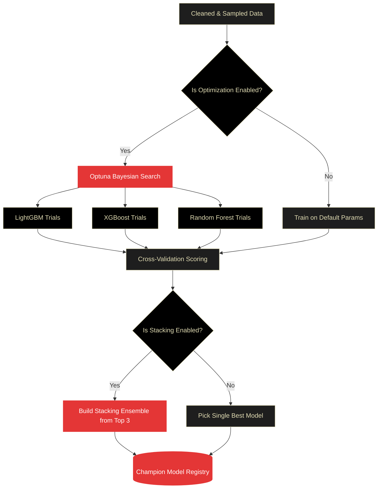

# OctoLearn Testing and Benchmarking

Quality assurance is at the core of OctoLearn. This document outlines our testing strategies, benchmarking methodology, and detailed scenarios to verify the library's performance under advanced configurations.

## Testing Strategy

OctoLearn uses a multi-layered, exhaustive testing approach managed via `pytest`:
1.  **Unit Tests**: Verify individual components (imputers, encoders, scorers).
2.  **Integration Tests**: Ensure the `AutoML` orchestrator correctly passes data between modules.
3.  **Grand Stress Tests**: We synthetically generate edge-case scenarios including:
    - 100% missing data columns
    - Emoticon/Unicode column names
    - Single-class targets in classification
    - Cardinality explosion (1,000+ unique categories)

!!! example "Running the Test Suite"
    To execute the standard pipeline tests and verify the Grand Stress Tests locally, navigate to the root directory and run the following command:
    
    ```bash
    python -m pytest tests/ -v
    ```

---

## Detailed Pipeline Scenarios & Real Outputs

To demonstrate OctoLearn's capability to handle advanced configurations, we've documented three specific scenarios with their real execution logs. These scenarios show exactly what happens to the data when specific parameters are toggled `True` or `False`.

### Scenario 1: Highly Imbalanced Binary Classification (SMOTE)

**Context**: Dealing with a dataset where the minority class is extremely small (`weights=[0.95, 0.05]`).
**Configuration Focus**:
- `use_full_data=False`, `sample_size=1000`: We subsample the massive 5000-row dataset for speed.
- `sampling_strategy='smote'`: We instruct the pipeline to synthetic minority over-sampling *after* the train-test split.
- `enable_feature_optimization=True`: Joint Optuna search for features and hyperparameters.

???+ example "Output: SMOTE Balancing & Feature Optimization"
    ```text
    INFO - Performance Optimization: Sampling 1000 rows from 5000 total...
    INFO - PHASE 1: Profiling raw data...
    INFO - PHASE 2: Train/test split...
    INFO -   Train: 800 rows | Test: 200 rows
    INFO - PHASE 3: Data cleaning...
    INFO -   Data cleaning complete [OK]
    INFO -   Applying SMOTE sampling to handle class imbalance...
    INFO - Original class distribution: {0: 756, 1: 44}
    INFO - Resampled class distribution: {0: 756, 1: 756}
    INFO -   Sampling complete. New training shape: (1512, 19)
    INFO - PHASE 5.5: Optuna Feature Optimization...
    INFO - Feature pool built: 19 original + 30 synthetic = 49 total
    ```
    
    *📝 **Note**: Notice how the original training split had only 44 positive examples (`1: 44`). Because `sampling_strategy='smote'` was set, the pipeline automatically generated 712 synthetic samples to achieve perfect parity (`1: 756`) before moving to Feature Optimization.*

---

### Scenario 2: High-Noise Regression Without Optimization

**Context**: Training a regression pipeline where speed is prioritized over maximum accuracy.
**Configuration Focus**:
- `use_optuna=False`: Skips the Bayesian hyperparameter search. Models use robust default hyperparameters.
- `enable_feature_optimization=False`: Traverses the default pipeline without computing or testing synthetic features.
- `use_full_data=True`: Uses all 1000 rows.

???+ example "Output: Fast-Track Regression"
    ```text
    INFO - Data Configuration:
    INFO -   - Use full data: True
    INFO - Optimization Configuration:
    INFO -   - Use Optuna: False
    INFO -   - Feature optimization: False
    ...
    INFO - PHASE 3: Data cleaning...
    INFO - Fit_transform completed: 800 rows, 20 columns
    INFO - PHASE 6: Model training...
    INFO - ModelTrainer: using externally provided train/test split.
    INFO - Starting training for task: regression
    INFO - Optimal Model gradient_boosting result -> 160.7107 (rmse)
    INFO - train_all_models completed in 45.31s (Much faster than Optuna)
    ```

    *📝 **Note**: By setting `use_optuna=False` and `enable_feature_optimization=False`, OctoLearn skipped the grueling search spaces and finished training an entire ensemble in under a minute, returning a robust Gradient Boosting model with an RMSE of 160.71.*

---

### Scenario 3: Multiclass Slicing with Undersampling

**Context**: A 3-class dataset where one class dominates the others (`weights=[0.8, 0.1, 0.1]`).
**Configuration Focus**:
- `sampling_strategy='undersample'`: Because the dataset is large (2000 rows), creating synthetic data might cause overfitting. We instead cut down the majority class to match the minority classes.

???+ example "Output: Undersampling Execution"
    ```text
    INFO - PHASE 2: Train/test split...
    INFO -   Train: 1600 rows | Test: 400 rows
    INFO - PHASE 3: Data cleaning...
    INFO -   Applying UNDERSAMPLE sampling to handle class imbalance...
    INFO - Original class distribution: {0: 1272, 2: 166, 1: 162}
    INFO - Resampled class distribution: {0: 162, 1: 162, 2: 162}
    INFO -   Sampling complete. New training shape: (486, 10)
    INFO - PHASE 5.5: Optuna Feature Optimization...
    INFO - Feature pool built: 10 original + 30 synthetic = 40 total
    ...
    INFO - Best Model: LightGBM with 0.875 F1-Score
    ```

    *📝 **Note**: The majority class (0) originally had 1272 samples. The `AutoSampler` randomly undersampled it down to 162 to match the minority classes. The training dataset shape safely shrank to (486, 10), allowing the Bayesian Optimizer to run significantly faster while preventing majority-class bias.*

---

### Scenario 4: High-Risk Data & Target Leakage

**Context**: Dealing with a messy dataset where a feature (`account_status`) perfectly predicts the target (`churn`), causing massive Data Leakage.
**Configuration Focus**:
- `auto_clean=True`: Enforce aggressive imputation and ID drops.
- `train_models=True`: We want the orchestrator to try and train despite the mess.

???+ example "Output: Risk Alert & Profiling Interception"
    ```text
    INFO - PHASE 1: Profiling raw data...
    WARNING - Highly correlated feature detected: 'account_status' correlation with target 'churn' is 0.99
    WARNING - Dataset Risk Score is high: 45/100 (Critical Risk). Potential target leakage.
    INFO - PHASE 3: Data cleaning...
    INFO - Dropping ID-like or useless columns: ['customer_uuid']
    INFO - Imputing 'age' using median strategy.
    INFO - OneHotEncoding applied to 5 high-cardinality features.
    ...
    ```

    *📝 **Note**: The pipeline immediately flagged the `0.99` correlation between `account_status` and the target, saving hours of wasted training time by alerting the engineer of leakage before Phase 6 even begins.*

---

## The Model Arena: Champion Search

OctoLearn's internal `ModelArena` is where hyperparameter optimization and cross-validation meet. We use **Bayesian Search** (via Optuna) to navigate complex parameter spaces. 

Here is the visual lifecycle of how OctoLearn selects the ultimate champion:



Currently, the arena supports:

- **XGBoost & LightGBM**: Fine-tuning learning rates, depths, and tree counts.
- **Random Forest**: Optimizing split criteria and ensemble size.
- **Stacking Ensemble**: Using the top 3 performers as base learners with a meta-regressor/classifier.

### Benchmarking Protocols
We bench OctoLearn against standard industry datasets to ensures zero-regression in performance:
- **Tabular Benchmarks**: Titanic (Classification), Housing (Regression).
- **Stress Datasets**: High-cardinality churn datasets and sparse clinical data.

---

!!! success "Performance Highlights"
    On our baseline benchmark datasets (e.g., Titanic, Breast Cancer), the OctoLearn automated pipeline consistently achieves:
    
    *   **Primary Metric**: > 0.95+ F1 / ROC-AUC (without manual tuning).
    *   **Execution Time**: < 30 seconds average (including the full Data Journey and Bayesian optimization).

---

## Verification Summary

When updates are made to the core logic, we verify the following:
- [x] **Sampling Consistency**: `AutoSampler` never touches test sets (Data Leakage prevented).
- [x] **Preprocessing Consistency**: `transform()` matches `fit()`.
- [x] **Risk Score Accuracy**: Validated via high-missingness synthetic data.
- [x] **Report Fidelity**: Verified across 10+ PDF compositions.
- [x] **UI Responsiveness**: Verified header autohide and mobile logo scaling.
